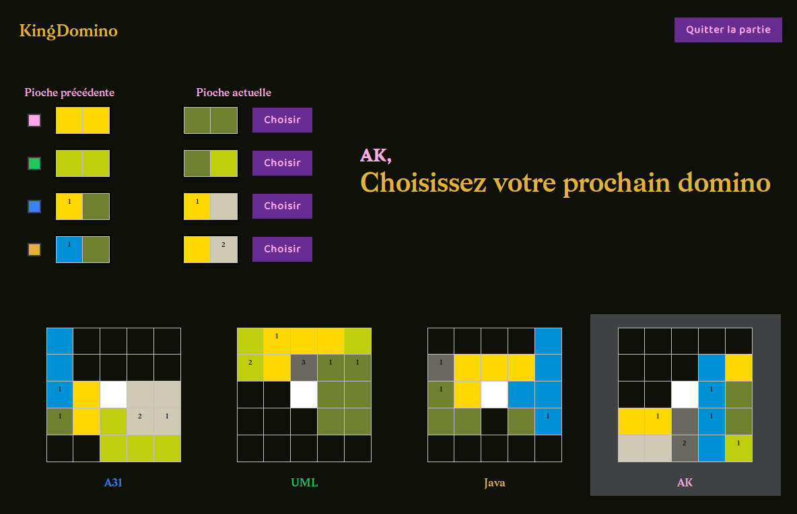

# A31 - KingDomino v2

## **Membres du groupes**

 * GUTMANN Franck
 * MANSOURI Sofiane

## Prérequis

**Pour jouer :**

- Java Runtime Environment 8 ou supérieur ([site officiel](https://www.java.com/fr/download/manual.jsp))
    
**Pour le développement :**

- Java SDK version 1.8 ([télécharger OpenJDK](https://www.openlogic.com/openjdk-downloads))

## Jouer à KingDomino

Pour jouer, rien de plus simple ! Il suffit d'exécuter le fichier `a31-kingdomino.jar` !
Choisissez vos règles, ajoutez les joueurs, et laissez vous guider par les instruction !

Vous ne savez pas comment jouer ? Lisez les [règles du jeu](https://git.unistra.fr/a313/a31-kingdomino/-/blob/master/docs/reglesKingdomino.pdf) !

## Générer un éxecutable

**Avec IntelliJ IDEA :**

1. Vérifiez la structure du projet (`File>Project Structure`) :
   
    - Exclure `rendu1` avec que les classes de l'ancienne version ne soient pas incluses dans l'executable
    - Définir `rendu2/ressources ` en tant que `Ressource root`
    - Définir 'rendu2/src' en tant que `Sources`

    

2. Toujours dans la même fenêtre, selectionnez `Artifacts` dans le menu de gauche

3. Sélectionnez `Add>JAR>From module with dependencies`
   
   

4. Selectionnez `rendu2/KingDomino.java` pour le champ Main class

   

5. IntelliJ est configuré, vous pouvez désormais générer l'executable à tout moment en allant dans le menu `Build > Build artifacts`, puis en cliquant sur `a31-kingdomino:jar>Build`.
   Le `.jar` généré est alors situé dans `out/artifacts/a31-kingdomino_jar/a31-kingdomino.jar`

   
